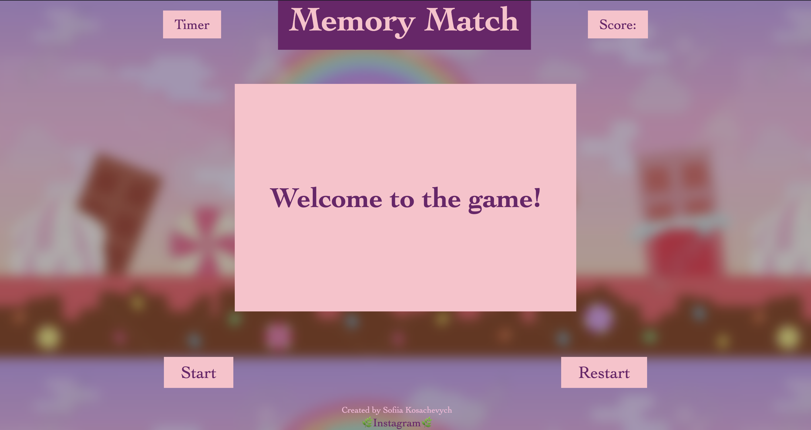
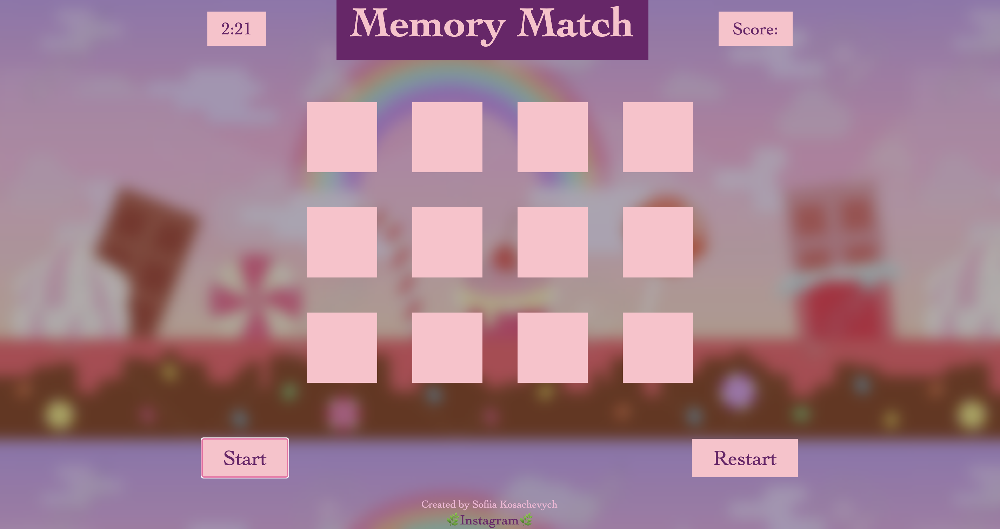
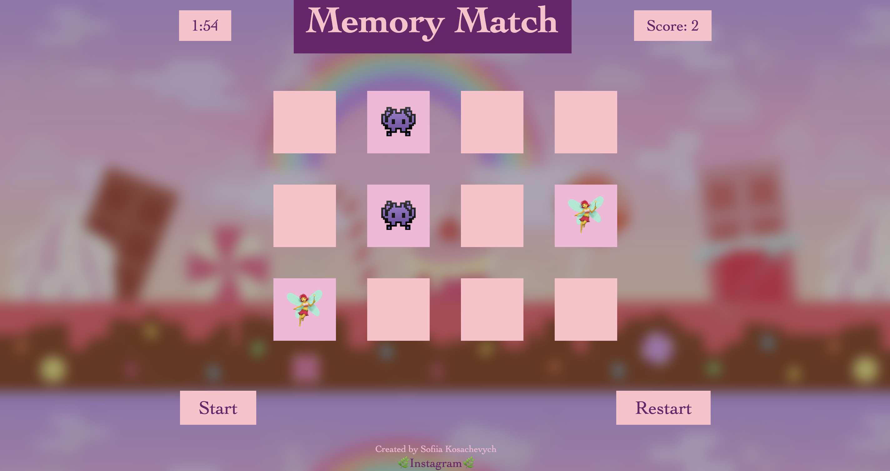
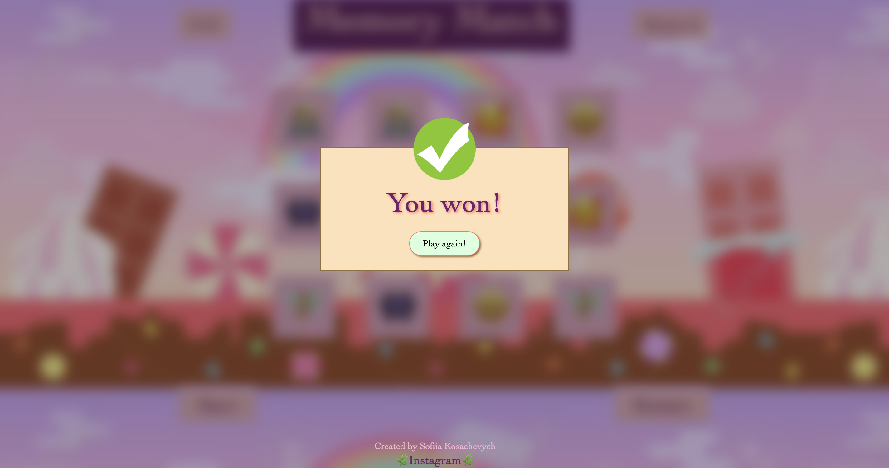
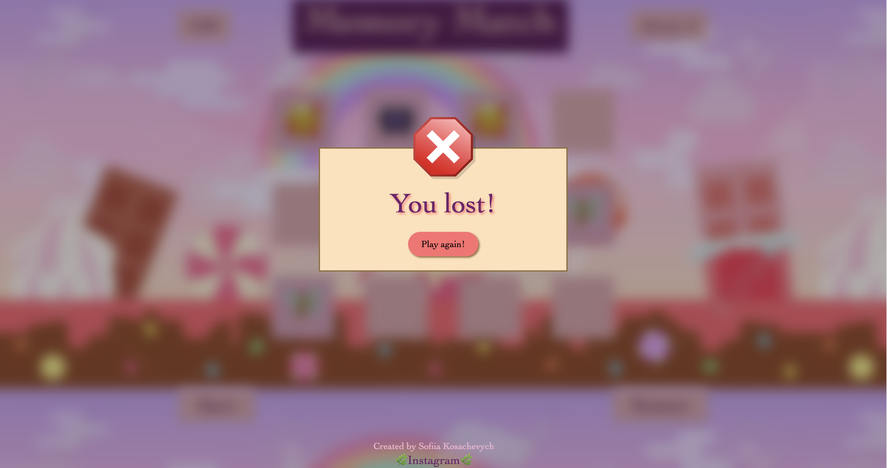

Hello! Welcome to Memory Match.

Click the button Start to start playing the game.
Your task is to find all the matching cards.
On the top of the page you can see the timer and the number of score. You have 2.5 minutes to win!
Have fun!

Link => https://sksoniaa.github.io/memory-game-project/

</img>
</img>
</img>
</img>
</img>
